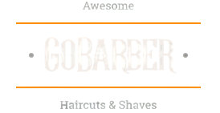
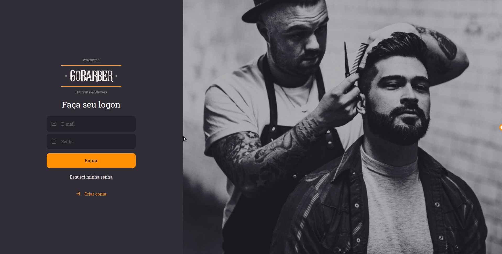

<h1 align="center">
 
    
     
     
    🚀 Bootcamp GoStack 🚀
</h1>

    &logo=<LOGO>"/>
    &logo=<LOGO>"/>
    &logo=<LOGO>"/>
    &logo=<LOGO>"/>

<h1> 📷 Projeto</h1>
<b>O GoBarber é uma aplicação que conecta barbeiros e clientes de forma simples e rápida</b>

 
    
    

 

## 🚀 Tecnologias 

Esse projeto foi desenvolvido utilizando as seguintes tecnologias: 

- ✔ Typescript

- ✔ ReactJS

- ✔ React Native

- ✔ NodeJS

- ✔ React Hooks

- ✔ Context API

- ✔ Styled-Components

- ✔ React Spring

- ✔ Polished

- ✔ Docker 

- ✔ PostgresSQL

- ✔ Axios

 

<h1> 📑 Licença</h1>
<b>Este projeto está sob a licença MIT. Veja a <a href="">LICENÇA</a> para mais informações</b>

 
 

<h1> 📭 Entre em contato</h1>
<a href="https://www.linkedin.com/in/s%C3%A9rgio-santiago-16427217a/"> 🔗 Linkedin</a>

 

Feito com ❤ por Sérgio Santiago

